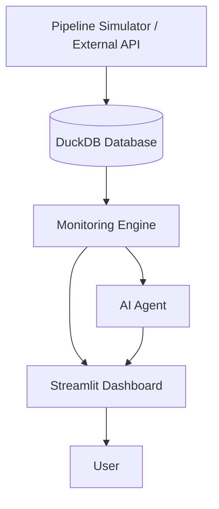

# System Architecture

**Version:** 0.1

**Author:** Emiliano Mayen

**Status:** Draft

---

# Overview

AI Pipeline Monitor follows a modular architecture designed to monitor enterprise data pipelines, store execution history, analyze failures, and provide AI-assisted diagnostics.

The architecture separates data collection, storage, monitoring, AI reasoning, and user interaction into independent components, making the platform scalable and maintainable.

---

# High-Level Architecture

---

# Architecture Components

## 1. Pipeline Simulator / External API

Responsible for providing pipeline execution data.

Initially, this component will generate simulated pipeline executions.

In future versions, it will connect to real enterprise platforms such as:

- Salesforce Datorama
- Airflow
- Fivetran
- Azure Data Factory
- Custom APIs

---

## 2. DuckDB Database

Stores all platform information including:

- Pipelines
- Execution History
- Errors
- AI Recommendations
- Statistics

The database acts as the central source of truth.

---

## 3. Monitoring Engine

Core business logic of the platform.

Responsibilities include:

- Reading pipeline executions
- Detecting failures
- Detecting anomalies
- Updating execution history
- Calculating KPIs
- Triggering AI analysis

---

## 4. AI Agent

The AI Agent analyzes pipeline failures and provides intelligent assistance.

Capabilities include:

- Explain failures
- Identify probable root causes
- Recommend corrective actions
- Answer natural language questions
- Learn from historical incidents
- Predict future failures (future release)

---

## 5. Dashboard

Provides users with a graphical interface.

The dashboard will display:

- Overall platform health
- Pipeline status
- Execution history
- Error analytics
- AI recommendations

---

# Data Flow

The platform follows the workflow below:

1. Pipeline data is collected.
2. Execution information is stored in DuckDB.
3. The Monitoring Engine analyzes pipeline health.
4. Failures are detected.
5. The AI Agent analyzes incidents.
6. Results are displayed in the dashboard.
7. Users interact with the AI Agent using natural language.

---

# Future Architecture

Future releases may include:

- Slack Notifications
- Microsoft Teams Integration
- Email Alerts
- REST API
- Authentication
- Multi-user Support
- Cloud Deployment
- Multiple AI Models
- RAG Knowledge Base
- Agent Memory

---

# Design Principles

The architecture follows these principles:

- Modular Design
- Scalability
- Maintainability
- Low Coupling
- High Cohesion
- Extensibility
- AI-First Design

---

# Technology Stack (Planned)

| Layer | Technology |
|---------|------------|
| Frontend | Streamlit |
| Backend | Python |
| Database | DuckDB |
| AI | OpenAI API |
| API | FastAPI |
| Containerization | Docker |
| Version Control | GitHub |
| Deployment | Azure / Render |

